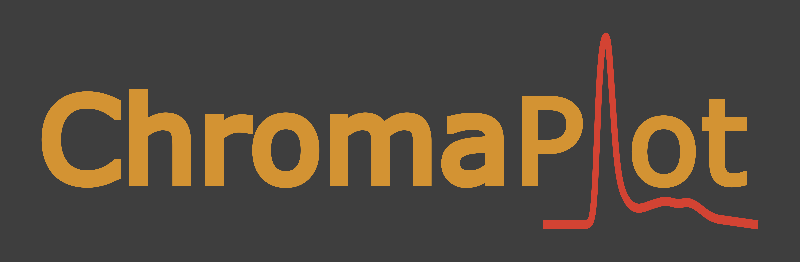

# 


**ChromaPlot v2** is a Python-based desktop application for creating high-quality chromatography figures from exported instrument data.

[Originally developed](https://github.com/beh22/ChromaPlot) for Cytiva ÄKTA chromatography systems, ChromaPlot v2 introduces a completely redesigned project-based workflow focused on flexibility, reproducibility, and publication-quality figure generation.

## Key Improvements Over ChromaPlot v1

ChromaPlot v2 is a complete rewrite of the original application with a much more flexible architecture and significantly expanded functionality.

### New Features in v2

- Project-based workflow with saveable `.chromaplot` project files
- Overlay multiple datasets within a single workspace
- Improved curve and dataset management
- Dataset-specific settings and metadata
- Improved plot customisation options
- Better export handling for publication-quality figures
- Improved GUI
- Improved importer framework for future dataset compatibility
- Cleaner and more maintainable internal code structure

## Supported File Formats

ChromaPlot v2 currently supports chromatography data exported from Cytiva ÄKTA systems using UNICORN software.

### Currently Supported

- Exported text-based chromatography files from UNICORN
  - `.txt`
  - `.csv`
  - `.asc`

As far as we are aware, exports from all versions of UNICORN are currently supported.

If you encounter a file that does not import correctly, please open an issue on GitHub and include:
- the UNICORN version (if known)
- the export format used
- a screenshot or example file if possible

### Planned Future Support

Additional chromatography and biophysical data formats are planned for future releases.

## Planned Features

The following features are planned for future releases:

- Fraction number display and annotation
- Shaded regions based on fractions or volume ranges
- Vertical marker / measurement tools
- Secondary axis support
- Additional dataset types
- Packaged desktop installers for macOS and Windows
- Update checker
- Additional analysis tools

<br>

# Installation

At the moment, ChromaPlot is distributed as a Python application. 

Packaged standalone applications for Windows and macOS will be introduced soon.

## Requirements

- Python 3.11 or newer
- Git

Optional but recommended:

- pipx

## Recommended Installation (pipx)

The recommended way to install ChromaPlot is with `pipx`.

`pipx` installs ChromaPlot into an isolated environment while making the `chromaplot` command globally available, so you do not need to manually activate a virtual environment each time you launch the application.

### 1. Install `pipx`

#### macOS

Using [Homebrew](https://brew.sh/):

```bash
brew install pipx
pipx ensurepath
```

#### Windows

```powershell
py -m pip install --user pipx
py -m pipx ensurepath
```

You may need to restart the terminal after running `ensurepath`.

See [here](https://pipx.pypa.io/stable/how-to/install-pipx/) for Linux installation or if you have problems installing `pipx`.

### 2. Install ChromaPlot

```bash
pipx install chromaplot
```

### 3. Launch ChromaPlot

```bash
chromaplot
```

You can now launch ChromaPlot directly from the terminal without activating any environment.


## Updating ChromaPlot (pipx)

To update to the latest version:

```bash
pipx upgrade chromaplot
```

## Development / Source Installation

If you want to run ChromaPlot directly from source code or contribute to development, you can install it manually.

It is recommended to do this inside a dedicated Python virtual environment to avoid dependency conflicts.

### 1. Clone the Repository

```bash
git clone https://github.com/beh22/ChromaPlot_v2.git
cd ChromaPlot_v2
```

### 2. Create a Virtual Environment

#### Option A — Standard Python `venv`

Create the environment:

```bash
python -m venv chromaplot_env
```

Activate it:

For macOS / Linux:

```bash
source chromaplot_env/bin/activate
```

For Windows:

```bash
chromaplot_env\Scripts\activate
```

#### Option B — Conda Environment

```bash
conda create -n chromaplot python=3.12
conda activate chromaplot
```

### 3. Install ChromaPlot

Install ChromaPlot and its dependencies:

```bash
pip install .
```

### 4. Launch ChromaPlot

```bash
chromaplot
```

## Updating a Source Installation

From inside the repository directory:

```bash
git pull
pip install .
```

If you are using a virtual environment, ensure it is activated before running the commands above.

<br>

## Project Status

ChromaPlot v2 is under active development.

While already functional and usable for figure generation, the application is still evolving and the project structure, GUI, and feature set may continue to change between releases.

Bug reports, suggestions, and feedback are very welcome.


## Support / Contact

### Reporting Issues

Please report bugs or feature requests through the GitHub Issues page:

- https://github.com/beh22/ChromaPlot_v2/issues

When reporting issues, please include:

- Operating system
- ChromaPlot version
- Steps to reproduce the issue
- Example files/screenshots if relevant

### Contact

For questions or other enquiries:

- Billy Hobbs — <billyehobbs@gmail.com>


## Acknowledgements

If ChromaPlot is used to generate figures for publications, presentations, or reports, an acknowledgement is appreciated.


## License

This project is licensed under the MIT License. See the `LICENSE` file for details.
